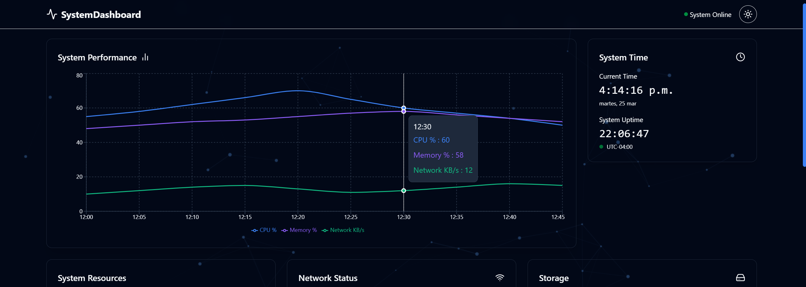
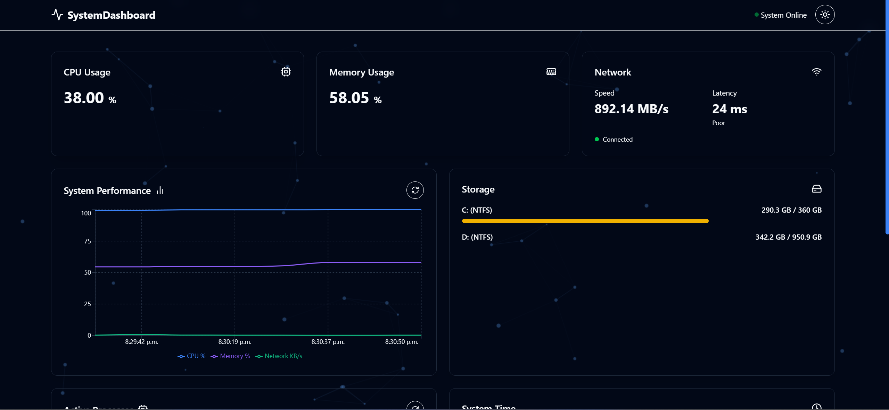
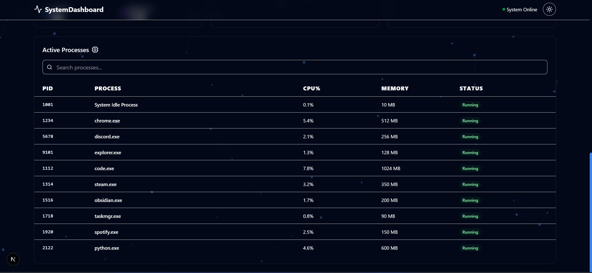

# SystemDashboard 🚀

**SystemDashboard** es un panel de monitorización del sistema en tiempo real que muestra información clave sobre el rendimiento de la PC, incluyendo CPU, memoria, red, almacenamiento y procesos activos, con un diseño moderno y elegante.  

## ✨ Características

- 📊 **Monitorización en Tiempo Real**: Datos actualizados de CPU, RAM, red y almacenamiento.
- 📈 **Gráficos Dinámicos**: Visualización en tiempo real con **Recharts**.
- 🌙 **Modo Oscuro**: Diseño elegante con Tailwind CSS.
- ⚡ **Interfaz Interactiva**: Filtros y paginación para procesos activos.
- 🌍 **Soporte para Múltiples Dispositivos**: Diseño responsive y adaptable.

## 📸 Capturas de Pantalla

## 📌 Gráfico estadístico


### 📌 Datos del sistema


### 📌 Lista de Procesos


## 🛠️ Tecnologías Usadas

- **Next.js** 🚀 - Framework React para aplicaciones web modernas.
- **React.js** ⚛️ - Librería para interfaces de usuario.
- **Tailwind CSS** 🎨 - Estilos modernos y responsivos.
- **Recharts** 📊 - Gráficos en tiempo real.
- **Systeminformation** 🔍 - Obtención de datos del sistema.

## 🚀 Instalación y Uso

### 1️⃣ Clonar el Repositorio
```bash
 git clone https://github.com/MikeDevQH/System-Dashboard.git
 cd System-Dashboard
```

### 2️⃣ Instalar Dependencias
```bash
 npm install
```

### 4️⃣ Ejecutar en Desarrollo
```bash
 npm run dev
```

## 🌟 Planes Futuros

🔹 **Mejoras en el diseño**: Agregar animaciones, transiciones y mejoras en la paleta de colores.  
🔹 **Soporte multi-idioma**: Agregar traducciones para una experiencia más accesible.  

## 🤝 Contribuciones
Las contribuciones son bienvenidas. Si encuentras un problema o tienes una idea para mejorar el proyecto:
1. Haz un fork del repositorio
2. Crea una nueva rama (`git checkout -b feature-nueva`)
3. Realiza tus cambios y haz commit (`git commit -m "Descripción"`)
4. Haz push a la rama (`git push origin feature-nueva`)
5. Abre un Pull Request

## 📄 Licencia
Este proyecto está bajo la Licencia MIT. ¡Disfrútalo y siéntete libre de mejorarlo! 🎉

## 💖 Creado por
Desarrollado con mucho ❤️ por [MikeDevQH](https://github.com/MikeDevQH). ¡Espero que te sea útil! 😊
